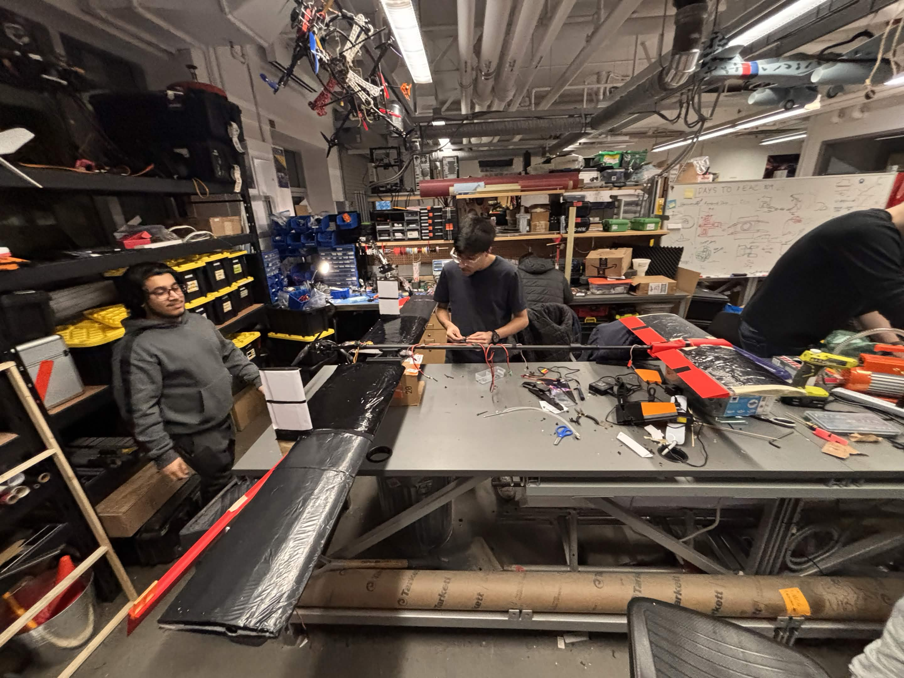
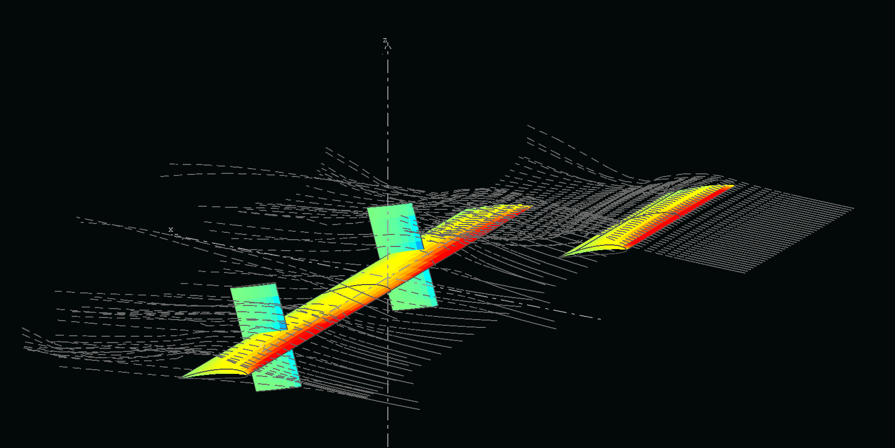
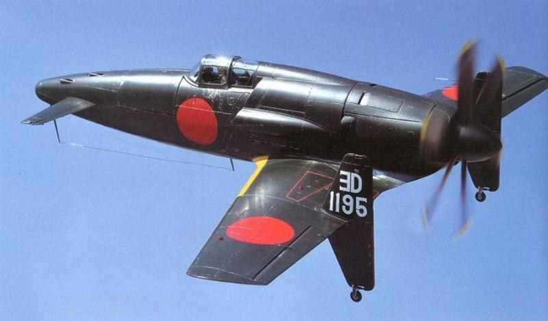
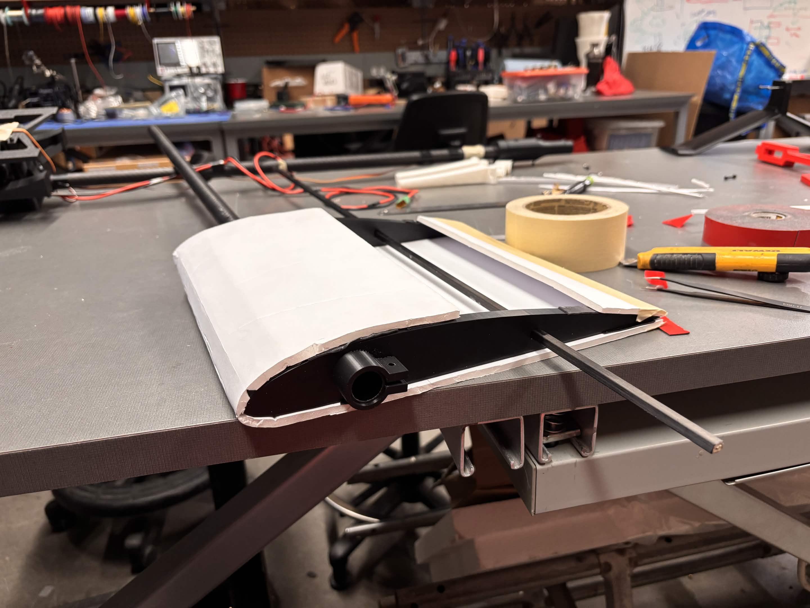

**Guardian** is the first fixed wing aircraft designed fully by the fixed wing division from UBCO Aerospace. This aircraft was created with the ultimate goal of enabling the division to **compete in international competitions** such as SAE, DBF, and other competitions of similar nature.

<video width="100%" height="auto" controls>
  <source src="guardian/flight.mp4" type="video/mp4">
  Your browser does not support the video tag.
</video>

*Guardian's first flight.*

---

## Motivation: Why did we build the Guardian?

Guardian was created with the ultimate goal of enabling the division to compete in international competitions. The aircraft was created with the dual long term intent of training members on aircraft design, manufacturing, flying and for the design to undergo iterative improvement.

*Construction of Guardian V1.*

In the past, the division has had other small and similarly sized aircraft, none of which combined the elements of being fully designed by the entire division, being actively maintained, and being of medium size. The training of members works in conjunction with iterative improvement; the training of new members comes firstly from previous knowledge being passed down verbally, which is then exercised when a component becomes damaged/needs to be repaired. Secondly, it comes from the aircraft, allowing members to have the freedom to innovate and improve on designs of previous generations. 

Having the ability to iteratively improve ultimately allows the aircraft to be a testbed for new electronics, aerodynamics, and manufacturing processes and design. As the time and monetary cost for crashing a competition ready fixed wing is high and as weight and robustness in most cases mutually exclusive, having the aircraft as a platform to test higher risk aerodynamics and structural designs is of great benefit.

## Design Philosophy: Why the Lifting Canard?

*Airflow simulation around the canard and wing.*

In 2025, the initial conceptional design for the guardian was to be a conventional aircraft, similar to the size and weight of another previous design called the Borzoi. It is to be a conventional aircraft with a V-tail, and a top mounted pusher propeller. 

However a point of divergence came with it came to deciding how to mount the propeller. Unlike the Borzoi the propeller of the guardian was much larger, and the BLDC motor was also a lot more powerful. Concerns arose regarding the pitching moment generated by a high mounted pusher, as well as how to protect such a larger propeller; as mentioned, one of the aircraft's goals was to train members on flying, therefore the primary concern became robustness and repairability, surpassing aerodynamics and weight efficiency. Protecting the propeller became a primary concern due to the lack of funding and the inconvenience of needing to replace propellers consistently.

Inspired by 2 real life canard aircraft found in a video game that many fixed wing members played, the Curtiss XP-55 and the Kyūshū J7W Shinden, it was realised that by using a canard design similar to the aforementioned aircraft and enlarging the vertical stabiliser, the rear mounted pusher propeller can be fully protected, regardless of whether the aircraft performs a conventional landing or a hard touchdown. The only scenario where the propeller and motor will be damaged is if the carbon fiber spar of the main wing broke (of which the vertical stabilisers are mounted to), a risk that was managed by using a carbon fiber spar with a factor of safety above 5 under normal loading conditions of level flight and a conservative estimate for landing speeds. 

*Japanese Kyūshū J7W Shinden from WWII, which inspired the canard design.*

## Specifications and Versions

### Guardian V1 
Constructed primarily of hotwired foam boards and carbon fiber rods connected by 3D printed joints. The wings and canards are both made with monkoted foam, and the vertical stabilisers were 3D printed. The main wing was made from 4 foam sections and the canards were made from 2. Most joints to carbon fiber rods, wingbox included, were 3D printed.

* **Wingspan:** 2 m
* **Weight:** ~3.5 kg
* **Stall angle:** 14o
* **Stall speed:** 7.827 m/s
* **Cl/Cd max ideal:** 16

### Guardian V2
Landing the V1 damaged the foam boards of the main wing. Failure of the foam occurred as expected at load bearing joints. Other flaws in V1 are:

1. The foam was load bearing as it was partially connected to the vertical stabilisers. The main flaw was having 1 spar in which the rotation of the entire wing was mainly constrained by foam. 
2. The connector to the front canard had a lot of room to rotate; this is due partially to tolerances in 3D printed parts, but could have been mitigated fully with design 
3. Inadequate aerodynamic analysis led to the main wing stalling before the canard. Although this was mitigated by telling the pilot to not exceed 15o AOA, a redesign of the canard is required

*V2 wing prototype.*

Although repairable, needing to repair the wing every flight is unacceptable. Version 2 aims to use stressed skin construction techniques by replacing the main wings with ribs contained by foam board skin. The foam board used is reinforced by paper on both sides, making it very strong in tension. V2 is currently under construction and is expected to be completed by the end of February 2026.

* **Wingspan:** 2 m
* **Weight:** ~3.5 kg
* **Stall angle:** 17o
* **Stall speed:** 6.3 m/s
* **Cl/Cd max ideal:** 15.5
