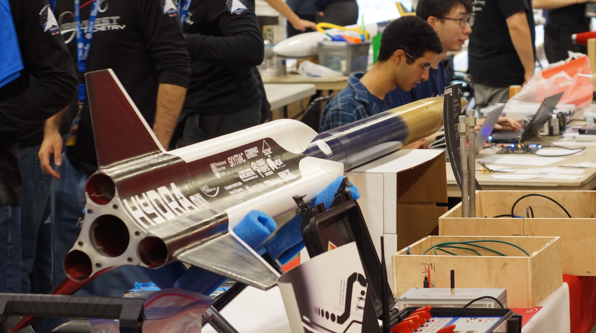
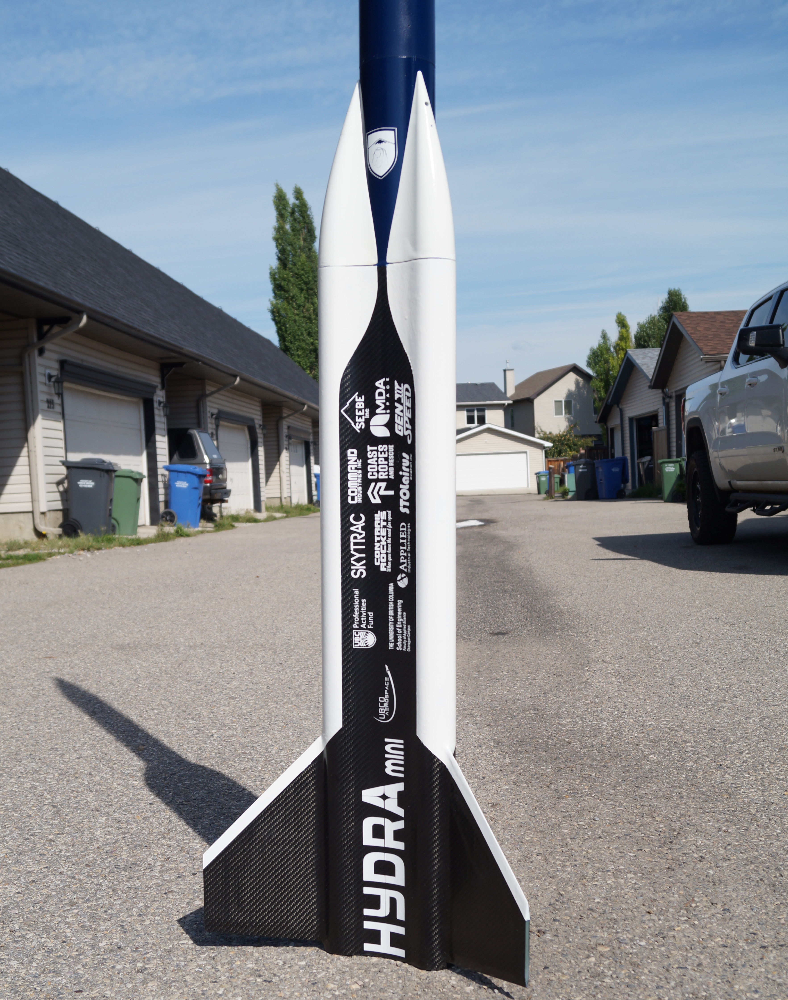
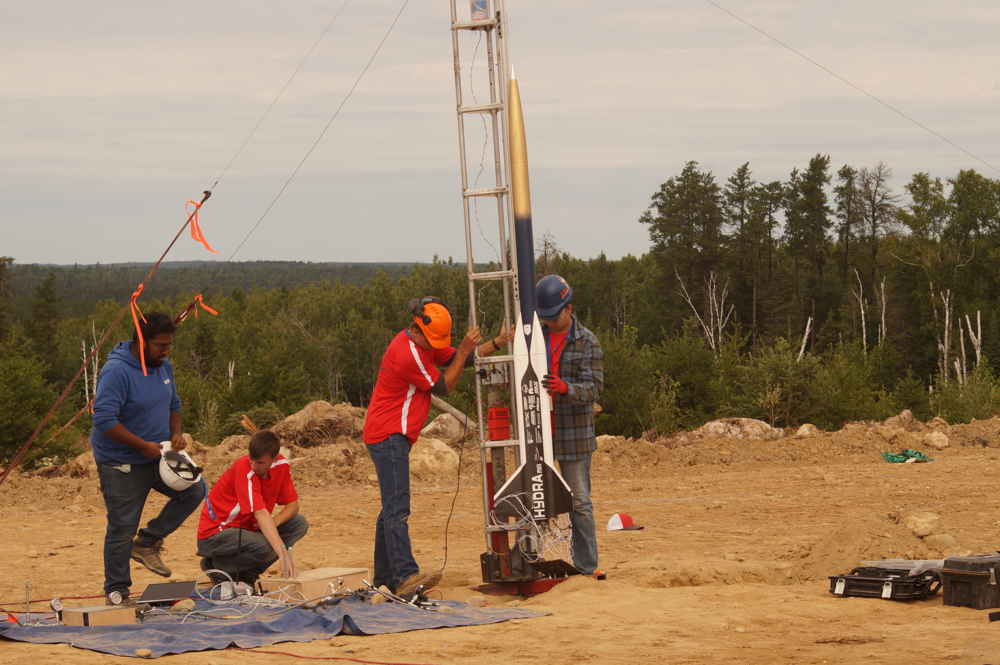

The Hydra Mini project was conceived with the intent to prove the feasibility of clustered hybrid propulsion, by flying a quad-motor demonstrator with three outboard boosters. We first began ideation on clustered designs in September of 2023, and after significant changes to the scope and scale of our design, began construction and testing in October of 2024. We expect this project to be complete with our test flight in Timmins this August.

An important question to answer before delving into the technicalities of clustered hybrids is: why pursue it at all? We believe that today’s most common rocket configuration, of a single motor at the base of the flight vehicle, limits the range of payloads a rocket can carry. By moving the motors to the outside, we free up a significant volume for payload, enabling us to carry large and lightweight articles, such as deployable long-range UAVs. This could be very useful in sectors such as search and rescue, reducing the deployment time of a high-altitude UAV while conserving its battery for efficient cruise flight.

Hydra Mini flew in August 2025 to an altitude of 5500ft, marking the first ever successful launch of a student-built clustered hybrid rocket. As we continue to explore bleeding edge of student rocketry, this project reminds us of what is possible through skill, dedication and a willingness to explore solutions well beyond the norm.

<video width="50%" height="auto" class="m-auto rounded-xl" controls>
  <source src="/rocketry/projects/hydra-mini/cluster_hybrid.mov" type="video/mp4">
  Your browser does not support the video tag.
</video>
