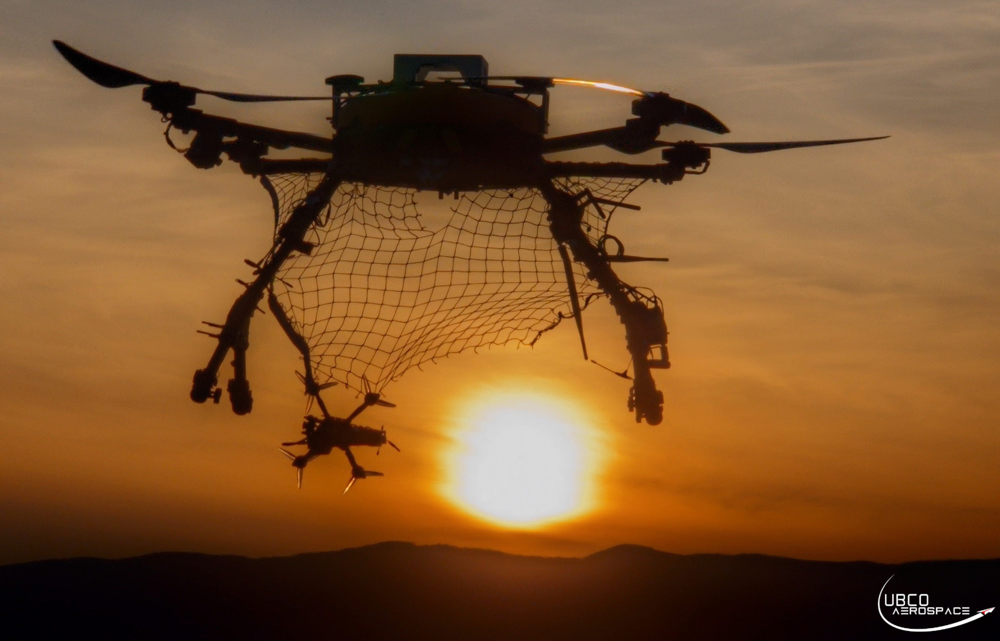
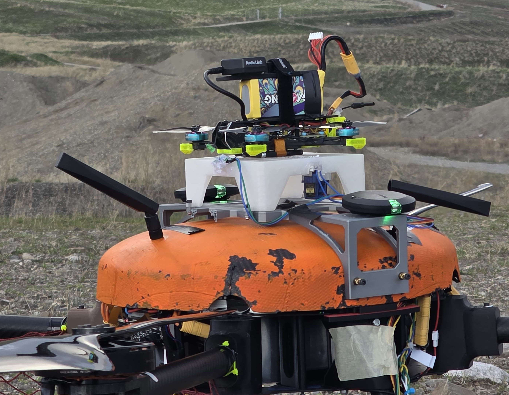
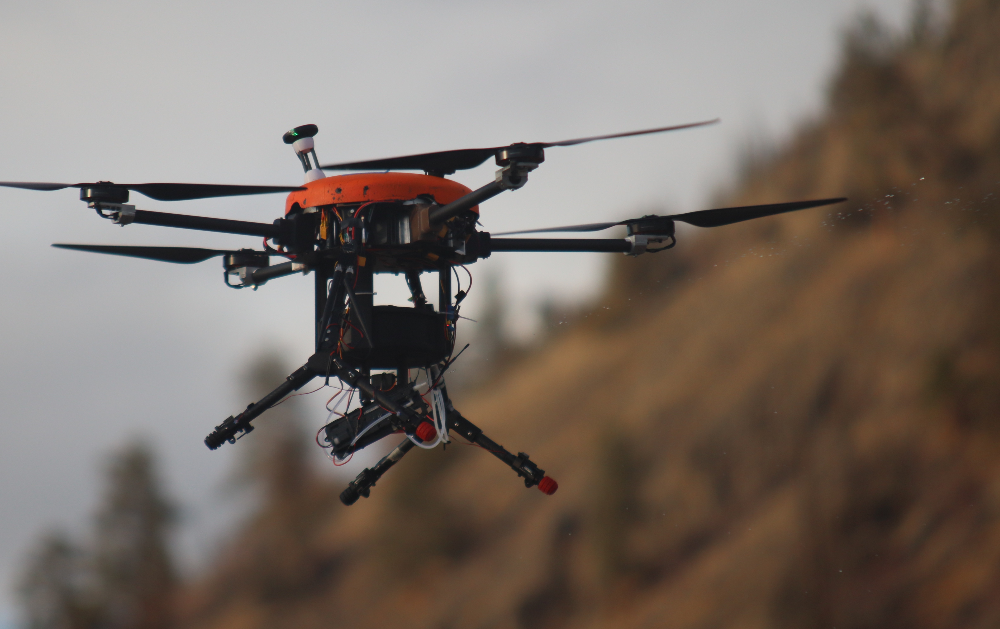
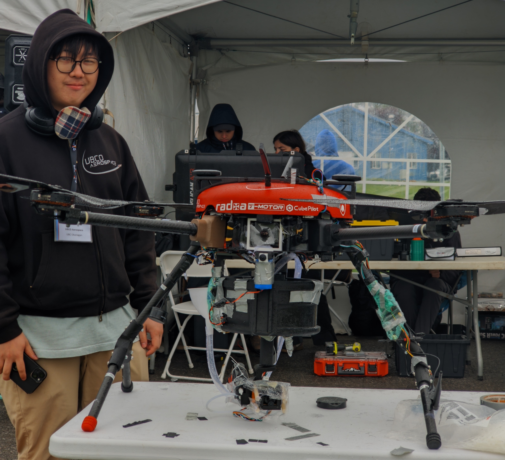
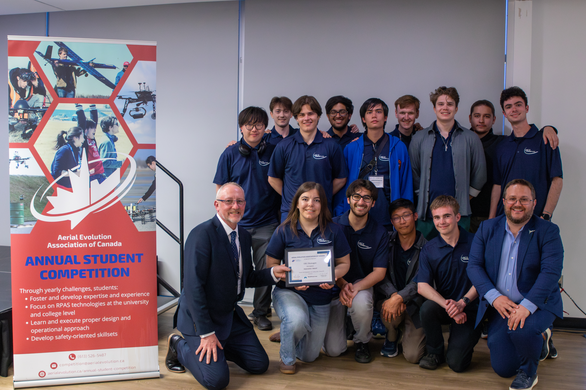

# Jellyfish 2026: A Mothership, a Scout, and a Water Cannon Walk Into a UAS Competition

When we set our sights on the 2026 AEAC National Student UAS Competition, we wanted to push beyond simply flying a well-tuned quadcopter. We wanted to try things the team had never done before. So this year, our aircraft **Jellyfish II** went to the competition carrying three ambitious ideas at once: autonomous payload delivery and reconnaissance, a turreted aerial firefighting system, and a "mothership" concept that launches and catches a smaller FPV scout drone mid-flight.

Here's an overview of what we built, what happened at competition, and what we learned.

<video width="100%" height="auto" class="rounded-xl" controls>
  <source src="/uav/projects/jellyfish-II-2026/ladder_release.mp4" type="video/mp4">
  Your browser does not support the video tag.
</video>

*Jellyfish testing the ladder payload deployment mechanism.*

---

## The Aircraft: Jellyfish II

Jellyfish II is our workhorse quadcopter, specially configured this year to support autonomous delivery, reconnaissance, and aerial firefighting. Throughout both competition tasks, the airframe itself proved to be one of the strongest parts of the project: stable, reliable, and consistent across every flight, even when the systems around it were not.

---

## The Ambitious One: A Mothership That Deploys and Catches a Scout Drone

*The scout drone caught in Jellyfish's net*

The most experimental part of Jellyfish 2026 was the **FPV Drone Release/Catch System**, a two-part concept in which a small FPV "scout" drone rides on top of Jellyfish, is released to perform its own mission, and then flies back into a net to be carried home.

It works like this:

- **Release:** The scout drone starts secured to the top of Jellyfish with a servo-actuated latch. When the Jellyfish pilot unlocks it, the scout takes off to do its reconnaissance work. A small green LED gives the scout pilot visual confirmation that the mechanism has let go.
- **Catch:** A net is stretched between Jellyfish's landing gear. On return, the scout flies into the net and its propellers tangle in it, securing it for the trip back to the landing zone.

We weren't sure it was even possible at first. We started by flying a standard 3.5-inch freestyle FPV drone as close underneath Jellyfish as possible, just to see how Jellyfish's propwash affected the smaller aircraft. Both pilots felt comfortable enough to keep going.

*Scout Drone Mounted and Locked on Jellyfish*

To comply with competition safety requirements, the scout drone had to run a GPS with geofence failsafes, which meant ArduCopter instead of Betaflight. That gave us the powerful Loiter flight mode, at the cost of the raw agility that FPV pilots are used to. We practiced takeoffs and catches first with Jellyfish disarmed on the ground, then while Jellyfish was hovering, and eventually drilled the sequence over and over for repeatability.

It worked — mostly. Across all our testing we only had three failures, and the system proved to be more reliable than we had any right to expect. But one of those failures came at the worst possible moment: during Task 1 at competition, damaged signal wiring to the servo left the scout drone stuck to Jellyfish and unable to take off. The mothership concept had to be scrubbed on the day.

We also learned some humbling lessons about flying a small drone near a big one. On one practice catch the scout drifted back into Jellyfish after an initial bump, was sucked into a carbon-fiber propeller, and came off second best — a damaged motor and a punctured battery. (Jellyfish's prop, amazingly, survived.) The likely culprit was Loiter mode fighting to return the drone to its target position rather than obeying the pilot's reflexes. The takeaway: in a loss-of-control situation near the mothership, manually disarm the scout instead of trying to fly out of it.

---

## The Water Cannon: An Aerial Firefighting Payload

*Water Turret Shooting Water in Flight*

The other major new payload this year was a **turreted fire extinguishing system**, which was a water gun that pitches and yaws to spray targets autonomously while the pilot handles navigation.

At competition the turret itself performed as designed, pitching and yawing correctly and throwing a stream that reached a target. But the system was let down by its video link: the dedicated LTE camera meant to aim the water gun was unreliable, so the pilot had to aim using Jellyfish's main front-facing analog camera instead, juggling aircraft positioning, target alignment, and payload firing all at once, with degraded visual feedback. We still wetted one target, confirmed by a single still frame squeezed through the LTE link. Not the full demonstration we wanted, but proof that the payload concept works.

---

## Competition Day: What Actually Happened

### Task 1 — Delivery & Reconnaissance

The plan: fly 3 laps autonomously, deliver a ladder and an oxygen tank to staging areas, and locate and identify targets, with the scout drone deployed partway through to help search.

What happened: GPS failures delayed autonomous takeoff by 15 minutes, so we cut the plan to 2 laps to preserve time. The laps themselves flew cleanly. Stable, autonomous, waypoints from the ground station, all payloads still attached. Then the scout drone release failed, so the mothership concept was abandoned. We delivered both payloads manually using a downward-facing camera to precision-land at each staging area, and visually identified three targets using the front and downward cameras before landing with two minutes to spare.

Verdict: a partial success. We didn't get to show off the dual-aircraft reconnaissance, but we hit the core objectives: laps, payload delivery, and target identification.

### Task 2 — Aerial Firefighting

*Jellyfish Before Task 2*

The plan: navigate Jellyfish through the UAM corridor to the fire site and let the turreted water system automatically spray targets.

What happened: setup issues and recurring QGroundControl failures delayed takeoff by almost 20 minutes, compounded by GPS reconfiguration carried over from the night before and spotty comms (intermittent LTE, intermittent analog backup video, a working-but-sluggish RFD900). We got airborne with about 10 minutes left, reached the fire site, and started manually spraying targets around the five-minute mark. The water gun camera was unreliable, so the pilot aimed with the main front camera and successfully wetted one target.

Verdict: a limited partial success. The aircraft did everything it was asked. Take off, enter the corridor, respond to ATC, reach the site, operate the payload, wet a target, and land, but setup delays, ground-station instability, and LTE degradation forced a much more manual mission than we'd planned.

---

## What We Learned

The competition confirmed that the **Jellyfish II platform is mature**. Its stability and reliability were never in question. The work now is in the systems around it:

- **Configuration freeze before departure.** Most of our lost time came from late changes to GPS, flight-controller parameters, and autonomy settings. Next year: a strict freeze, with any late change requiring a full startup test and sign-off from the subsystem lead.
- **Rehearse degraded-mode procedures.** When QGroundControl and LTE underperformed, we adapted with RC override, RFD900X telemetry, and the analog camera, but it cost us. Define *before* flight when to abandon LTE, which telemetry link becomes primary, who calls the transition, and what minimum information is needed to keep flying safely.
- **Don't overload the pilot.** Aiming a water cannon while hand-flying an aircraft near obstacles is too much for one person. We need a dedicated payload-operator role, rehearsed, including the case where the payload camera is unavailable.
- **Build for quality, not just function.** The scout-drone release failed because of a worn, cheap servomotor that passed unit and integration testing but gave up on game day. Individual part quality matters more than we'd budgeted for.
- **Respect the full spec envelope.** We designed payload mounts to the stated maximum dimensions and then had to improvise when the actual items were smaller. Build to the range, not the upper bound.

---

## Looking Ahead

Jellyfish 2026 was the year we stopped just flying the aircraft and started building a mission system around it: a mothership, a water cannon, autonomous delivery, and a scout drone that takes off from and returns to another drone in mid-air. Some of it worked at competition. Some of it didn't. All of it moved the team forward.

The platform is solid. The concepts are proven. The work ahead is about reliability, operations, and integration. Turning ambitious ideas that work on the bench into systems that work on game day. We're already looking forward to next year.

*Team picture with the Innovation Award*
