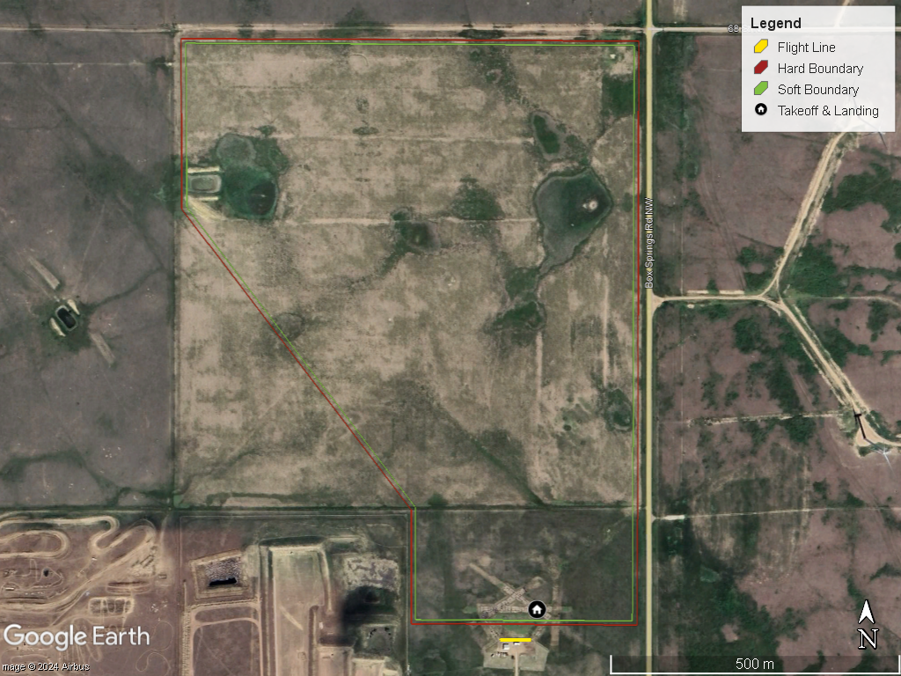
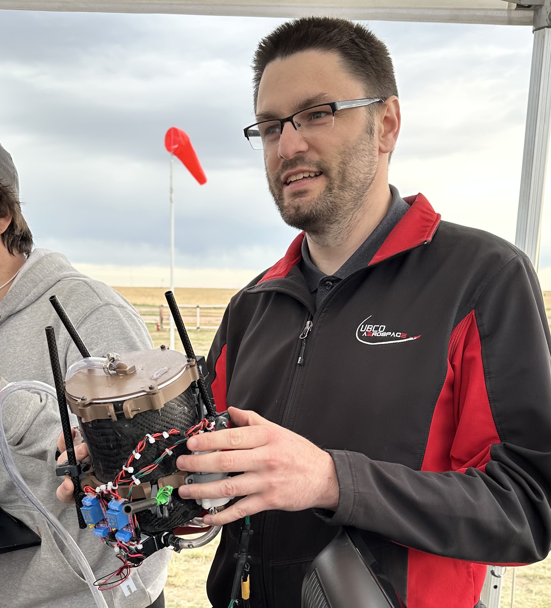

**Jellyfish V2** is UBCO Aerospace’s student-built drone, designed to compete in the **2025 Aerial Evolution Association of Canada (AEAC) Student UAS Competition**. This national competition challenges university teams to design, build, and fly drones capable of supporting **wildfire detection and response**.  

---

## Why We Built Jellyfish V2  
After Canada’s record-breaking wildfire season in 2023, the AEAC created a competition where students design drones to help detect fires early and deliver water to hotspots.  

  

*Competition site at Medicine Hat, Alberta — where the 2025 AEAC Student UAS Competition was held.*  

---

## The Competition Tasks  
The AEAC competition required teams to complete two missions:  

1. **Hotspot Detection and Mapping**  
   - Find simulated wildfire “hotspots” (infrared beacons).  
   - Identify the cause of the fire.  
   - Submit a digital map (KML file).  

2. **Water Transport**  
   - Pick up water from a large tank.  
   - Drop it into smaller target buckets across the field.  
   - Deliver as much water as possible, as evenly as possible.  

---

## The Drone: Jellyfish V2  
Jellyfish V2 was designed from the ground up to meet these wildfire challenges.  

  

*Integrated water tank and hose assembly used for Task 2.*  

- **Aircraft Design**: Carbon fiber quadcopter frame.  
- **Motors & Power**: MN8012 Antigravity motors + dual 27Ah Li-ion batteries for **30+ minutes of flight**.  
- **Payload**:  
  - **Hotspot Detection**: Infrared camera with custom filter + onboard AI.  
  - **Water Transport**: Cylindrical baffled tank with dual pumps and solenoid valves.  
- **Autonomy**: Capable of automated takeoff, mapping, and water drops — with manual override for safety.  

---

## Performance at the 2025 AEAC Competition  

### Task 1 – Hotspot Detection  
  

*Preperation of the drone prior to take-off for Task 1.*  

Jellyfish began its autonomous search but faced camera and telemetry issues. Midway, a motor controller (ESC) failure forced an emergency landing.  

### Task 2 – Water Transport  
  

*Custom baffled water tank stabilized against sloshing during flight.*  

In Task 2, Jellyfish successfully pumped and carried water. Strong prairie winds and connectivity issues required manual intervention, but the tank and pump system validated well under real-world conditions.  

---

## What We Learned  
- **Reliability is key**: A single solder fault caused a mission-ending ESC failure.  
- **Autonomy under pressure**: Our AI and pumping systems worked in testing but struggled in competition.  
- **Weather resilience**: Tank baffles and vibration dampers helped keep Jellyfish stable in high winds.  

---

## Looking Ahead  
Future work will focus on:  
- More robust electronics and redundancy.  
- Improved real-time hotspot detection.  
- Greater autonomy in water pickup and delivery.  

---

## About the Team  
The **UBCO Aerospace** is a student-run group developing drones and aerospace tech. Competitions like AEAC allow us to test designs against real-world wildfire challenges.  
